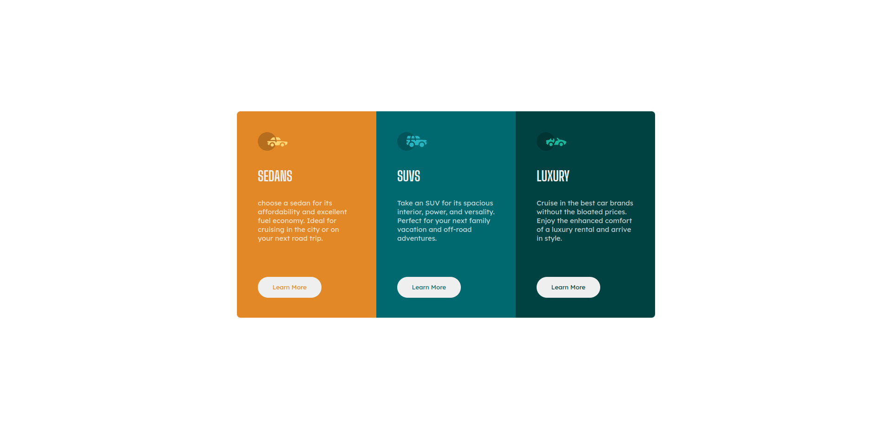

# Frontend Mentor - 3-column preview card component solution

This is a solution to the [3-column preview card component challenge on Frontend Mentor](https://www.frontendmentor.io/challenges/3column-preview-card-component-pH92eAR2-). Frontend Mentor challenges help you improve your coding skills by building realistic projects.

## Table of contents

- [Overview](#overview)
  - [The challenge](#the-challenge)
  - [Screenshot](#screenshot)
  - [Links](#links)
- [My process](#my-process)
  - [Built with](#built-with)
  - [What I learned](#what-i-learned)
  - [Useful resources](#useful-resources)
- [Author](#author)
- [Acknowledgments](#acknowledgments)

## Overview

### The challenge

Users should be able to:

- View the optimal layout depending on their device's screen size
- See hover states for interactive elements

### Screenshot

### Links

- Solution URL: [Add solution URL here](https://github.com/Valhalla-2/3-column-preview-card)
- Live Site URL: [Add live site URL here](https://your-live-site-url.com)

## My process

### Built with

- Semantic HTML5 markup
- CSS custom properties
- Flexbox
- Mobile-first workflow

### What I learned
css Flexbox & design website in responsive mode

### Useful resources

- [This Video](https://youtu.be/srvUrASNj0s?list=PL6Efx19_XLN9e5BwNvUg62gbNINyabt-_) - This helped me to make my site responsive with less strugle. I really liked this video and will use it going forward.
- [FreeCodeCamp](https://www.freecodecamp.org/news/html-page-width-height/) - This is an amazing article which helped me finally understand,on how to Set HTML & Body 's  Width and Height for Full Page Size. I'd recommend it to anyone still learning this concept.

## Author
- Frontend Mentor - [@valhalla-2](https://www.frontendmentor.io/profile/Valhalla-2)
- Github - [@valhalla-2](https://github.com/Valhalla-2)

## Acknowledgments

Thanks [Kevil Powell](https://www.youtube.com/kepowob) for taeching Css in a little less painful way & also thanks to [FreeCodeCamp](https://www.freecodecamp.org/) for their well crafted documentation.
